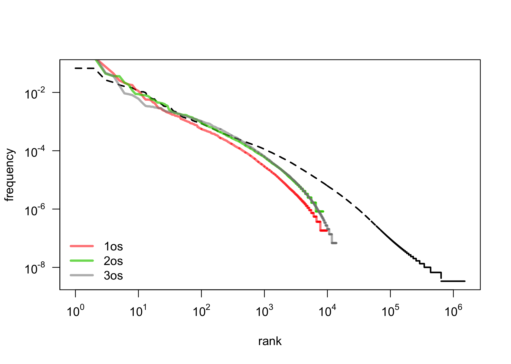

---
title: Zipf’s Law and Subsets of Lexis
author: Maciej Eder, Rafał L. Górski, Joanna Byszuk
date: July 5, 2018
output:
  rmdshower::shower_presentation:
    self_contained: false
    theme: ribbon
    center: true
    ratio: 4x3
    katex: true
    fig_width: 8.5
    fig_height: 5.5
---


```{r setup, include=FALSE}
# set global chunk options

library(knitr)
library(poweRlaw)

load("data/zipf_models_fits.Rdata")
final_models_ngrams = final_models
load("data/zipf_models_big.Rdata")
final_models_gramm = final_models
load("data/zipf_models_zipfy.Rdata")
final_models_gramm2 = final_models
load("data/zipf_models_subst.Rdata")
final_models_subst = final_models

a = read.csv("data/zipf_kategorie_model_parameters_duże_wszystkie.xlsx - zipf_kategorie_model_parameters.csv")

my.blue = rgb(0.15, 0.45, 0.96)
my.green = rgb(0.15, 0.85, 0.27, 0.7)
my.red = rgb(0.92, 0.3, 0.3, 0.6)
my.grey = rgb(0,0,0,.5)
my.orange = rgb(1,0.5,0.2,0.6) 
my.teal = rgb(0, 0.5, 0.5, 0.7)  #### or: my.teal = rgb(0.24, 0.65, 0.75, 0.7)
my.violet = rgb(0.75, 0.25, 0.82, 0.7)

opts_chunk$set(cache = TRUE)
```


## { .white }

<p class="black" style="font-size: 240%; margin-bottom: 0.5em; margin-top: 0.5em;">
Zipf’s Law and Subsets of Lexis</p>
<p class="black" style="font-size: 120%; margin-bottom: 1em"> 
Maciej Eder, Rafał L. Górski, Joanna Byszuk</p>
<p class="black" style="font-size: 80%; margin-bottom: 0.5em;">
Institute of Polish Language (Polish Academy of Sciences)</p>
<p></p>
<p class="black" style="font-size: 100%; margin-top: 4em;">
Qualico 2018, Wrocław, 5th July 2018
</p>


## Zipf's law and language
<!-- 
* Zauważono, że język jest zipfowski
    * Ale co to znaczy “język”?
    * Czy formy? Czy lematy?
    * Czy to działa w każdym języku?
    * Czy jeśli działa na “Onieginie”, to zadziała dla całego korpusu?
    * Czy zadziała dla poszczególnych kategorii gramatycznych?
* Czy tylko w języku? (por. np. rozkład cząstek chemicznych etc., bogactwa)
Piantadosi (2015) -->

* It has been observed that the language is Zipfian.
* However, what is “the language”?
  * orthographic forms or lemmata?
  * only words or grammatical categories as well?
  * unigrams or also n-grams?


  

## 

{width=700px}


## Zipf’s Law on a log-log scale

{width=800px}


## Research question

* If the distribution of all the words in the corpus is Zipfian, is the distribution of **a subset of these words** also Zipfian?
* Since a text is a sum of nouns, verbs, adjectives, prepositions etc., is the distribution of **particular classes** (nouns, verbs etc.) also Zipfian?


## Observations on Brown Corpus

> [W]ord categories are also fit nicely [...] perhaps even more closely than words—but the shape of the fit [...] differs. 

> The general pattern suggests that a full explanation of the word frequency distribution would ideally call on mechanisms general enough to apply to syntactic categories and possibly even other levels of analysis.

(Piantadosi, 2014)


## Dataset
  
* The balanced version of the National Corpus of Polish 
  * 300 mln segments, i.e. roughly 250 mln words.
* The POS tags and lemmata taken as they are. 


## Categories

* Very granular parts of speech in the National Corpus of Polish.
  * e.g. _subst:sg:nom:m1_, _adj:sg:nom:n:pos_, etc. 
* For that reason, we split the tags:
  * the proper POS: _subst_, _adj_, _fin_, _prep_, ...
  * the number: _sg_, _pl_
  * the case: _nom_, _gen_, _dat_, ...
  * the person: _1st_, _2nd_, _3rd_ (not included in a tag)
* Independently, we tested POS-tag n-grams


<!-- * However, there are two “hyper POS-tages”:
  * _Verb_: all traditional verbal classes
  * _Noun_: nouns, gerunds, and pronouns -->

<!-- a POS pcon - is one of 4 Polish participles, a rule of thumb: a Part of Speech is a class, which shares exactly the same set of “Grammatical classes used in the National Corpus of Polish are more precisely delimited and, overall, finer-grained than traditional parts of speech. The classes assumed here are based on the notion of flexeme, narrower than the notion of lexeme. As a rule of thumb: a grammatical class is an entity, which shares a same set of inflecting categories, eg. since present-tense verbs bear person, but not gender and past-tense verbs vice-versa, they are distinct parts of speech-->


## First observations: _singular_ vs. _plural_

{width=800px}


## First observations: _1st_, _2nd_, _3rd person_

{width=800px}


## First observations: _cases_

{width=800px}


## First observations: _POS-tag ngrams_

{width=800px}


## Modeling a power law distribution

``` {r echo = FALSE, message = FALSE, include = FALSE}
var_frequency = c(1:100)
var_rank = c(1:100)
```


* Since linear regression is simple to apply:

``` {r echo = TRUE, message = FALSE}
model = lm( var_frequency ~ var_rank )
```

* Maybe it could be applied to a log-transformed dataset?

``` {r echo = TRUE, message = FALSE}
model = lm( log(var_frequency) ~ log(var_rank) )
```


## Linear regression on log-log data

> If in so doing one discovers a distribution that approximately falls on a straight line, then one can, **if one is feeling particularly bold**, assert that the distribution follows a power law, with a scaling parameter α  given by the absolute slope of the straight line.

(Clauset et al., 2009)


## Fitting a power law

* Maximum likelihood estimators (MLEs) for continuous datasets

$$ \alpha = 1 + n \Big[ \sum_{i=1}^{n} \ln \frac{x_i}{x_{min}} \Big] ^{-1} $$

* MLEs for discrete datasets:

$$ \alpha \simeq 1 + n \Big[ \sum_{i=1}^{n} \ln \frac{x_i}{x_{min} - \frac{1}{2}} \Big] ^{-1} $$

* $x_{min}$ is estimated using the Kolmogorov-Smirnov (KS) statistic:

$$ D = \max_{x \geq x_{min}} | S(x) - P(x) |  $$


## Fitted parameters: $x_{min}$ (cutoff)

``` {r echo = FALSE, message = FALSE}

plot(final_models_ngrams[[3]], type = "l", lty = 2, lwd = 1,
      axes = FALSE, xlab = "rank", ylab = "frequency", main = "")

# adding a model
#lines(final_models_ngrams[[3]], col = my.red, lwd = 3)
yticks = 10^rev(seq(0L,10L,2L)*-1)
axis(side = 2, yticks, sapply(log10(yticks), function(i) as.expression(bquote(10^ .(i)))), las = 2 )
xticks = 10^seq(0L,6L,1L)
axis(side = 1, xticks, sapply(log10(xticks), function(i) as.expression(bquote(10^ .(i)))) )
# adding a vertical line at the cutoff point
cutoff = a[a[,1] == "jeden_control_count.txt",6]
segments(cutoff, 10E-3, cutoff, 10E-6, col = my.blue, lwd = 5)

#text(cutoff, 10E-3, expression(x_(min)), pos = 4)
#text(cutoff, 10E-3, paste(substitute(paste(italic(x)[2], " = ")), r2.adj), pos = 4)

text(cutoff, 10E-3, substitute(italic(x)[min] == 9), pos = 4)
#text(100, 10E-2, substitute(alpha == 1.55), pos = 4)
box()
```


## Fitted parameters: $\alpha$ (scaling)

``` {r echo = FALSE, message = FALSE}

plot(final_models_ngrams[[3]], type = "l", lty = 2, lwd = 1,
      axes = FALSE, xlab = "rank", ylab = "frequency", main = "")

# adding a model
lines(final_models_ngrams[[3]], col = my.red, lwd = 3)
yticks = 10^rev(seq(0L,10L,2L)*-1)
axis(side = 2, yticks, sapply(log10(yticks), function(i) as.expression(bquote(10^ .(i)))), las = 2 )
xticks = 10^seq(0L,6L,1L)
axis(side = 1, xticks, sapply(log10(xticks), function(i) as.expression(bquote(10^ .(i)))) )
# adding a vertical line at the cutoff point
cutoff = a[a[,1] == "jeden_control_count.txt",6]
segments(cutoff, 10E-3, cutoff, 10E-6, col = my.blue, lwd = 5)

#text(cutoff, 10E-3, expression(x_(min)), pos = 4)
#text(cutoff, 10E-3, paste(substitute(paste(italic(x)[2], " = ")), r2.adj), pos = 4)

text(cutoff, 10E-3, substitute(italic(x)[min] == 9), pos = 4)
text(100, 10E-2, substitute(alpha == 1.55), pos = 4)
box()
```


## Results

* We fitted power law parameters for different categories:
    * grammatical classes (parts of speech)
    * inflection categories (cases, persons, numbers)
    * POS-tags combined in 2-grams, 3-grams, ..., 8-grams
* We compared $\alpha$ (scaling) of the estimated models
* We compared the proportion of observations above $x_{min}$


## What is perfectly Zipfian?

Prepositions and conjuctions:

| POS   | Occurrences | $\alpha$ | ZTypes | ZTokens |
|:-----:|:----------:|:---------:|:------:|:-------:|
| prep  | 28,787,398 | 1.14      | 97.9%  | 99.99%  |      
| conj  | 10,455,657 | 1.21      | 81.03% | 99.99%  |      
| comp  | 4,145,149  | 1.2       | 87.23% | 99.99%  |        

* Short, closed classes
* Non-Zipfian elements include archaic vocabulary, present but underrepresented in relation to the whole corpus.


## What is least Zipfian?

Participles:

| POS   | Occurrences | $\alpha$ | ZTypes | ZTokens |
|:-----:|:----------:|:---------:|:------:|:-------:|
| praet | 11,995,036 | 1.97      | 5.12%  | 81.23%  |         
| pant  | 35,235     | 2.05      | 14.54% | 79.09%  |         
| ppas  | 3,187,531  | 2.24      | 4.62%  | 68.1%   |        
| pact  | 1,209,948  | 2.25      | 3.5%   | 65.32%  |         
| pcon  | 662,548    | 2.3       | 4.5%   | 64.38%  | 

* Why? They’re very productive!


      
## Major parts of speech

* Subject and verb:
  * Tokens - over 99% and 95% respectively
  * Types - both only 17%
* Adjectives and adverbs:
  * Tokens - 94% and 98%
  * Types - 10% and 18%


## Cases

Stable, (un)expected Zipf results for both types and tokens:

| Case | ZTypes | ZTokens |
|:----:|:------:|:-------:|
| acc  | 98%    | 18%     |
| voc  | 95.5%  | 10%     |
| dat  | 93%    | 7%      |
| loc  | 91%    | 3.5%    |
| gen  | 88%    | 7%      |
| inst | 75%    | 2.5%    |
| nom  | 65%    | 2.5%    |


## Relation between $\alpha$ (scaling) and coverage?

* Is there any relation between the parameter $\alpha$ (or slope of the model) and the number of observations above the $x_{min}$ cutoff point?
* To address it, we modeled:
  * the relation between $\alpha$ and the proportion of **tokens** $\geq x_{min}$
  * the relation between $\alpha$ and the proportion of **types** $\geq x_{min}$


## Parameter $\alpha$ vs. $\sqrt{\%}$ of Zipfian tokens

``` {r echo = FALSE, message = FALSE}
plot(a[,3] ~ sqrt(a[,13]), ylab = expression(alpha), xlab = "sqrt(% of Zipfian tokens)", type="n")
text(sqrt(a[,13]), a[,3], gsub("_count.txt", "", a[,1]), cex = 0.8)
model = lm(a[,3] ~ sqrt(a[,13]))
r2.adj = round(summary(model)[[9]], 3)
abline(model, col = rgb(0.92, 0.3, 0.3, 0.6), lwd = 3)
legend("bottomright", bty = "n", legend = paste(expression(R^2), "(adjusted) =", r2.adj))
```


## Parameter $\alpha$ vs. $\%$ of Zipfian types

``` {r echo = FALSE, message = FALSE}
plot(a[,3] ~ c(100-a[,11]), ylab = expression(alpha), xlab = "% of Zipfian types", type="n")
text(c(100-a[,11]), a[,3], gsub("_count.txt", "", a[,1]), cex = 0.8)
model = lm(a[,3] ~ c(100-a[,11]))
r2.adj = round(summary(model)[[9]], 3)
abline(model, col = rgb(0.92, 0.3, 0.3, 0.6), lwd = 3)
#legend("bottomleft", legend = paste(substitute(paste(italic(R)^2, " (adjusted)")), r2.adj), bty = "n")
#legend("bottomright", bty = "n", legend = r2.adj)
legend("bottomleft", bty = "n", legend = paste(expression(R^2), "(adjusted) =", r2.adj))
```


## Conclusions

* Unzipped language categories do not necessarily follow a power law distribution
* Productivity of a class seems to be responsible for a heavy tail
* Classes of relatively low productivity (_voc_, _praep_) do follow Zipf’s law
* The relation between $\alpha$ (the scaling parameter) and the proportion of a class following Zipf’s distribution worth further exploration.


## Thank you!

* [\@MaciejEder](https://twitter.com/MaciejEder)
* [\@jbyszuk](https://twitter.com/jbyszuk)
* [https://github.com/computationalstylistics](https://github.com/computationalstylistics)


This research is part of project UMO-2013/11/B/HS2/02795, supported by Poland’s National Science Centre.
