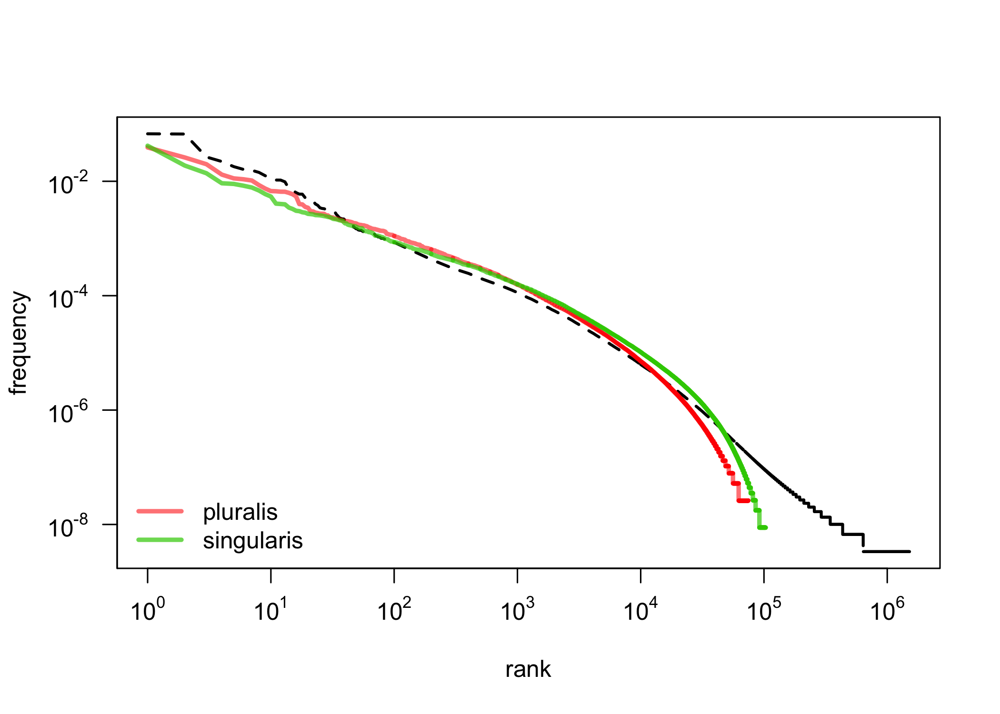
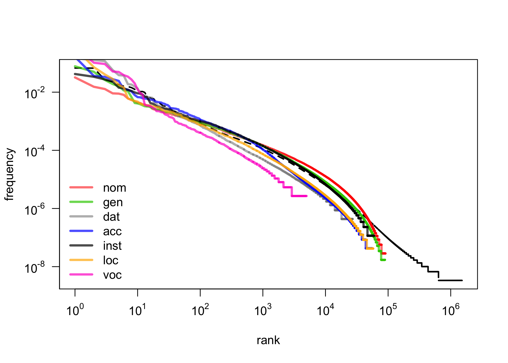
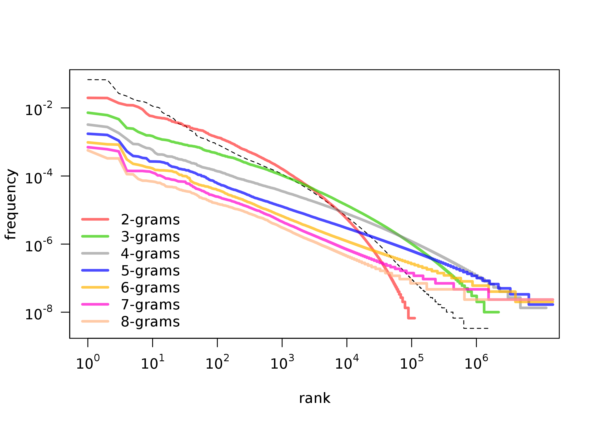

---
title: Zipf’s Law and Subsets of Lexis
author: Maciej Eder, Rafał L. Górski, Joanna Byszuk
date: July 5, 2018
output:
  rmdshower::shower_presentation:
    self_contained: false
    theme: ribbon
    center: true
    ratio: 4x3
    katex: true
    fig_width: 9
    fig_height: 6
---


```{r setup, include=FALSE}
# set global chunk options

library(knitr)
library(poweRlaw)

load("data/zipf_models_fits.Rdata")
final_models_ngrams = final_models
load("data/zipf_models_big.Rdata")
final_models_gramm = final_models
load("data/zipf_models_zipfy.Rdata")
final_models_gramm2 = final_models
load("data/zipf_models_subst.Rdata")
final_models_subst = final_models


a = read.csv("data/zipf_kategorie_model_parameters_duże_wszystkie.xlsx - zipf_kategorie_model_parameters.csv")


my.blue = rgb(0.15, 0.45, 0.96)
my.green = rgb(0.15, 0.85, 0.27, 0.7)
my.red = rgb(0.92, 0.3, 0.3, 0.6)
my.grey = rgb(0,0,0,.5)
my.orange = rgb(1,0.5,0.2,0.6) 
my.teal = rgb(0, 0.5, 0.5, 0.7)  #### or: my.teal = rgb(0.24, 0.65, 0.75, 0.7)
my.violet = rgb(0.75, 0.25, 0.82, 0.7)

opts_chunk$set(cache=TRUE)
```


# Zipf’s law and subsets of lexis
Maciej Eder, Rafał L. Górski, Joanna Byszuk

Wrocław, 5th July 2018.


## Zipf's law observed for language
<!-- 
* Zauważono, że język jest zipfowski
    * Ale co to znaczy “język”?
    * Czy formy? Czy lematy?
    * Czy to działa w każdym języku?
    * Czy jeśli działa na “Onieginie”, to zadziała dla całego korpusu?
    * Czy zadziała dla poszczególnych kategorii gramatycznych?
* Czy tylko w języku? (por. np. rozkład cząstek chemicznych etc., bogactwa)
Piantadosi (2015) -->

* It has been observed that the language is Zipfian.
* However, what is “the language”?
  * orthographic forms or lemmata?
  * only words or grammatical categories as well?
  * unigrams or also n-grams?


## 

{width=700px}


## Zipf’s Law: an example

{width=800px}


## Research question

* If the distribution of all the words in the corpus is Zipfian, is the distribution of **a subset of these words** also Zipfian?
* Since a text is a sum of nouns, verbs, adjectives, prepositions etc., is the distribution of **particular classes** (nouns, verbs etc.) also Zipfian?


## Dataset
  
* The balanced version of the National Corpus of Polish 
  * 300 mln segments, i.e. roughly 250 mln words.
* The POS tags in Polish are very granular. 
* However, there are two “hyper POS-tags”:
  * _Verb_: all traditional verbal classes
  * _Noun_: nouns, gerunds, and pronouns


## First observations: _sg_ vs. _pl_

{width=800px}


## First observations: _1st_, _2nd_, _3rd_ person

{width=800px}


## First observations: _cases_

{width=800px}


## First observations: _POS-tag ngrams_

{width=800px}


## Modeling a power law distribution

``` {r echo = FALSE, message = FALSE, include = FALSE}
var_frequency = c(1:100)
var_rank = c(1:100)
```


Maybe a well-known linear regression:

``` {r echo = TRUE, message = FALSE}
model = lm( var_frequency ~ var_rank )
```

could be applied to a log-transformed dataset?

``` {r echo = TRUE, message = FALSE}
model = lm( log(var_frequency) ~ log(var_rank) )
```


## Linear regression on log-log data

> If in so doing one discovers a distribution that approximately falls on a straight line, then one can, **if one is feeling particularly bold**, assert that the distribution follows a power law, with a scaling parameter α  given by the absolute slope of the straight line.

(Clauset et al., 2009)


## Fitting a power law

Maximum likelihood estimators (MLEs) for continuous datasets

$$ \alpha = 1 + n \Big[ \sum_{i=1}^{n} \ln \frac{x_i}{x_{min}} \Big] ^{-1} $$

MLEs for discrete datasets:

$$ \alpha \simeq 1 + n \Big[ \sum_{i=1}^{n} \ln \frac{x_i}{x_{min} - \frac{1}{2}} \Big] ^{-1} $$

$x_{min}$ is estimated using the Kolmogorov-Smirnov (KS) statistic:

$$ D = \max_{x \geq x_{min}} | S(x) - P(x) |  $$


## Fitted parameters for the entire corpus

``` {r echo = FALSE, message = FALSE}

plot(final_models_ngrams[[3]], type = "l", lty = 2, lwd = 1,
      axes = FALSE, xlab = "rank", ylab = "frequency", main = "")

# adding a model
lines(final_models_ngrams[[3]], col = my.red, lwd = 3)
yticks = 10^rev(seq(0L,10L,2L)*-1)
axis(side = 2, yticks, sapply(log10(yticks), function(i) as.expression(bquote(10^ .(i)))), las = 2 )
xticks = 10^seq(0L,6L,1L)
axis(side = 1, xticks, sapply(log10(xticks), function(i) as.expression(bquote(10^ .(i)))) )
# adding a vertical line at the cutoff point
cutoff = a[a[,1] == "jeden_control_count.txt",6]
segments(cutoff, 10E-3, cutoff, 10E-6, col = my.blue, lwd = 5)

#text(cutoff, 10E-3, expression(x_(min)), pos = 4)
#text(cutoff, 10E-3, paste(substitute(paste(italic(x)[2], " = ")), r2.adj), pos = 4)

text(cutoff, 10E-3, substitute(italic(x)[min] == 9), pos = 4)
text(100, 10E-2, substitute(alpha == 1.55), pos = 4)
box()
```


## Results

* We fitted power law parameters for different categories:
    * grammatical classes (parts of speech)
    * inflection categories (cases, persons, numbers)
    * POS-tags combined in 2-grams, 3-grams, ..., 8-grams
* We compared $\alpha$ (the slope) of the estimated models
* We compared the proportion of observations above $x_{min}$


## Cases

Stable, (un)expected Zipf results for both types and tokens

| Case | token | type |
|:----:|:-----:|:----:|
| acc  | 98%   | 18%  |
| voc  | 95.5% | 10%  |
| dat  | 93%   | 7%   |
| loc  | 91%   | 3.5% |
| gen  | 88%   | 7%   |
| inst | 75%   | 2.5  |
| nom  | 65%   | 2.5  |


## Parameter $\alpha$ vs. % of Zipfian tokens

``` {r echo = FALSE, message = FALSE}
plot(a[,3] ~ sqrt(a[,13]), ylab = expression(alpha), xlab = "sqrt(% of Zipfian tokens)", type="n")
text(sqrt(a[,13]), a[,3], gsub("_count.txt", "", a[,1]), cex = 0.8)
model = lm(a[,3] ~ sqrt(a[,13]))
r2.adj = round(summary(model)[[9]], 3)
abline(model, col = rgb(0.92, 0.3, 0.3, 0.6), lwd = 3)
legend("bottomright", bty = "n", legend = paste(expression(R^2), "(adjusted) =", r2.adj))
```


## Parameter $\alpha$ vs. % of Zipfian types

``` {r echo = FALSE, message = FALSE}
plot(a[,3] ~ c(100-a[,11]), ylab = expression(alpha), xlab = "% of Zipfian types", type="n")
text(c(100-a[,11]), a[,3], gsub("_count.txt", "", a[,1]), cex = 0.8)
model = lm(a[,3] ~ c(100-a[,11]))
r2.adj = round(summary(model)[[9]], 3)
abline(model, col = rgb(0.92, 0.3, 0.3, 0.6), lwd = 3)
#legend("bottomleft", legend = paste(substitute(paste(italic(R)^2, " (adjusted)")), r2.adj), bty = "n")
#legend("bottomright", bty = "n", legend = r2.adj)
legend("bottomleft", bty = "n", legend = paste(expression(R^2), "(adjusted) =", r2.adj))
```


## Conclusions


## Thank you!

* [\@MaciejEder](https://twitter.com/MaciejEder)
* [\@jbyszuk](https://twitter.com/jbyszuk)
* [https://github.com/computationalstylistics](https://github.com/computationalstylistics)


This research is part of project UMO-2013/11/B/HS2/02795, supported by Poland’s National Science Centre.
